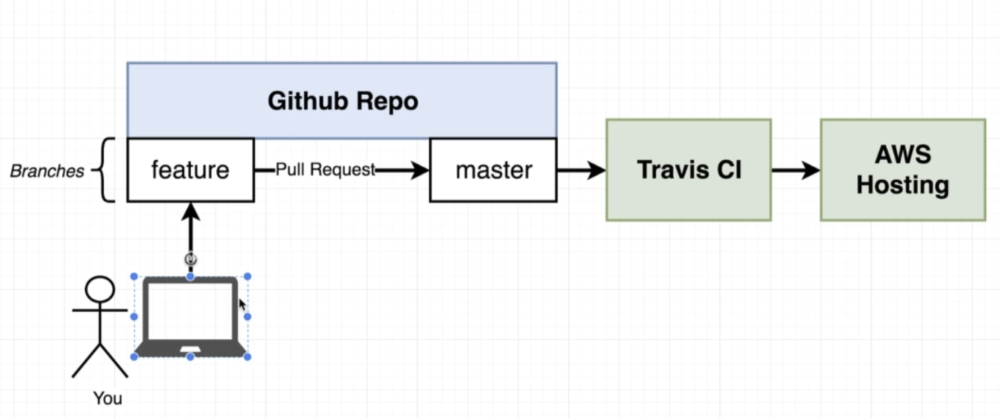

### Intro
Environment was created just as a lab exercise between the integration of containers, repository and cloud provider

### Workflow
Integratation with [Travis CI](https://travis-ci.com/) in order to follow CI practices according to the following image, so that we can push our code to [AWS Elastic Beanstalk](https://aws.amazon.com/elasticbeanstalk/). 

### AWS
Since Travis CI will need to connect through AWS in order to deploy our master's changes as per the example ahead (i.e., pull request/merge from *feature*), we'll require a user with the proper permission, and an Elastic Beanstalk environment in place. With this, we'll be able to configure our `.travis.yml` and the environment variables that Travis CI will use (e.g., AWS_ACCESS_KEY).

###### User and Role
For this step, you can create a user with Programmatic access (i.e., no console access), and associate a managed or inline policy:
* **AWS Managed Policy** -> As Elastic Beanstalk is a feature that needs particular interactions with different services (e.g., ec2, auto scale, security groups, cloud formation...) and resources, you can use the *AdministratorAccess-AWSElasticBeanstalk*. Depending on your environment, please notice that this policy might not take into consideration the least privilege principle, given the services/actions/resources within the statements.
* **Inline Policy** -> Instead of an AWS managed policy, we can create an inline policy and allow only the required permissions for a single environment. 

### Travis CI environment variables
In order to allow the interaction between Travis CI and AWS, ensure to create the environment variables associated with the *AWS_ACCESS_KEY* and *AWS_SECRET_KEY*. Ensure to also configure the build log to [hide this information from being displayed](https://docs.travis-ci.com/user/best-practices-security#recommendations-on-how-to-avoid-leaking-secrets-to-build-logs)